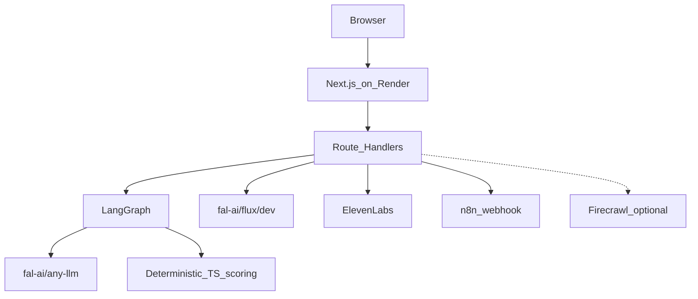

# Thunder

**Test your post before your audience does.**

Thunder is a **scenario-testing** product: audience twin + multi-agent jury + deterministic before/after scoring. It turns historical comments into an evidence-backed audience twin, runs a LangGraph rehearsal on **fal.ai** language models, scores drafts with transparent TypeScript formulas, and produces an improved five-slide carousel (optional cover, voiceover, n8n handoff).

> Thunder runs a grounded scenario simulation based on patterns in the creator’s supplied audience data. It does **not** predict real humans perfectly, guarantee virality, or forecast exact views.

## Stack

- Next.js 15 (App Router) + TypeScript + Tailwind
- Zod contracts on every AI/API boundary
- LangGraph.js orchestration: normalize → audience (fal) → evidence → **3 parallel jurors** → critic → TS scoring → strategy (+ voiceoverScript) → optimized eval → final verify
- **fal.ai** via `fal-ai/any-llm` + `fal-ai/flux/dev` (not direct OpenAI as default)
- Honest modes: **Live** / **Seeded demo** / **Recovery fallback** (never silent fake-live)
- Optional Firecrawl source URL, ElevenLabs voiceover, n8n webhook export

## Model IDs (fal catalog)

| Role | Env | Default ID |
|------|-----|------------|
| Text endpoint | `FAL_TEXT_ENDPOINT` | `fal-ai/any-llm` |
| Audience research | `FAL_AUDIENCE_MODEL` | `google/gemini-2.5-flash-lite` |
| Jurors (×3 parallel) | `FAL_JUROR_MODEL` | `google/gemini-2.5-flash` |
| Critic | `FAL_CRITIC_MODEL` | `anthropic/claude-3-5-haiku` |
| Strategy | `FAL_STRATEGY_MODEL` | `google/gemini-2.5-flash` |
| Cover image | `FAL_IMAGE_MODEL` | `fal-ai/flux/dev` |
| Voice | `ELEVENLABS_MODEL_ID` | `eleven_multilingual_v2` |

## Quick start

```bash
cp .env.example .env.local
# paste keys later — leave placeholders empty for Seeded demo / Recovery fallback
npm install
npm run dev
```

Open [http://localhost:3000](http://localhost:3000), click **Load seeded demo**, then **Run Audience Test**.

## Keys you must paste (hackathon credits)

| Key | Where | Notes |
|-----|-------|-------|
| `FAL_KEY` | [fal.ai dashboard](https://fal.ai/dashboard/keys) | Required for **Live** analysis + covers |
| `FIRECRAWL_API_KEY` | [firecrawl.dev](https://www.firecrawl.dev/) | Optional source URL scrape |
| `ELEVENLABS_API_KEY` + `ELEVENLABS_VOICE_ID` | [elevenlabs.io](https://elevenlabs.io/) | Optional voiceover; Discord coupon may apply |
| `N8N_WEBHOOK_URL` | n8n Cloud webhook (see below) | Optional Approve & Send |
| `NEXT_PUBLIC_APP_URL` | Your Render URL | After deploy |

Leave unused keys blank. `THUNDER_ENABLE_FALLBACK=true` keeps the demo working with a clearly labeled **Recovery fallback**.

## n8n import

1. Open n8n Cloud → **Workflows** → **Import from File**
2. Import [`n8n/thunder-approved-content.workflow.json`](n8n/thunder-approved-content.workflow.json)
3. Open **Webhook** node → copy **Production** URL
4. Paste into `.env.local` as `N8N_WEBHOOK_URL=…`
5. Activate the workflow
6. In Thunder carousel stage → **Approve & Send to n8n**

API: `POST /api/export/n8n`

## Scripts

```bash
npm run dev
npm run lint
npm run typecheck
npm test
npm run build
```

## Demo path (~2 minutes)

1. Load seeded demo (consistency / hustle draft with weak absolutes)
2. Run Audience Test → badge shows Seeded demo or Live / Recovery fallback
3. Audience Twin → 3 evidence-backed segments
4. Reaction Lab → disagreement across segments
5. Diagnostics → deterministic scores + guardrails
6. Optimized carousel → Generate Cover / Voiceover / Approve & Send to n8n
7. Before / After score table + technical credibility panel

## Architecture



See [docs/architecture.md](docs/architecture.md) for full Mermaid (importable into diagrams.net).

## Deploy (Render)

1. Connect `https://github.com/harshjoshi23/Thunder.git` in Render
2. Use `render.yaml` (Frankfurt, health check `/api/health`)
3. Paste env vars from `.env.example` (especially `FAL_KEY`)
4. Deploy — live URL appears in the Render dashboard

```bash
# local check
curl https://YOUR-APP.onrender.com/api/health
```

## Future (not in hackathon scope)

- Redis / Kafka fan-out for multi-tenant scale — document only; not implemented
- Social auto-post — intentionally out of scope (n8n receives approved payloads only)

## Honest limitations

- Jury agents simulate segments from **imported comments**, not live humans
- Scores are transparent formulas over LLM factor ratings — not platform analytics
- Without `FAL_KEY`, runs are **Seeded demo** or **Recovery fallback**, never fake Live
- Firecrawl / ElevenLabs / n8n are optional; missing keys degrade with labeled recovery

## Docs

- [docs/demo-script.md](docs/demo-script.md)
- [docs/judge-questions.md](docs/judge-questions.md)
- [docs/architecture.md](docs/architecture.md)
- [docs/render-n8n-guide.md](docs/render-n8n-guide.md)
- [docs/EXPLAINER.md](docs/EXPLAINER.md)

## License

**GPL-3.0** — see [`LICENSE`](LICENSE).

Built for Cursor Hackathon Stuttgart.
