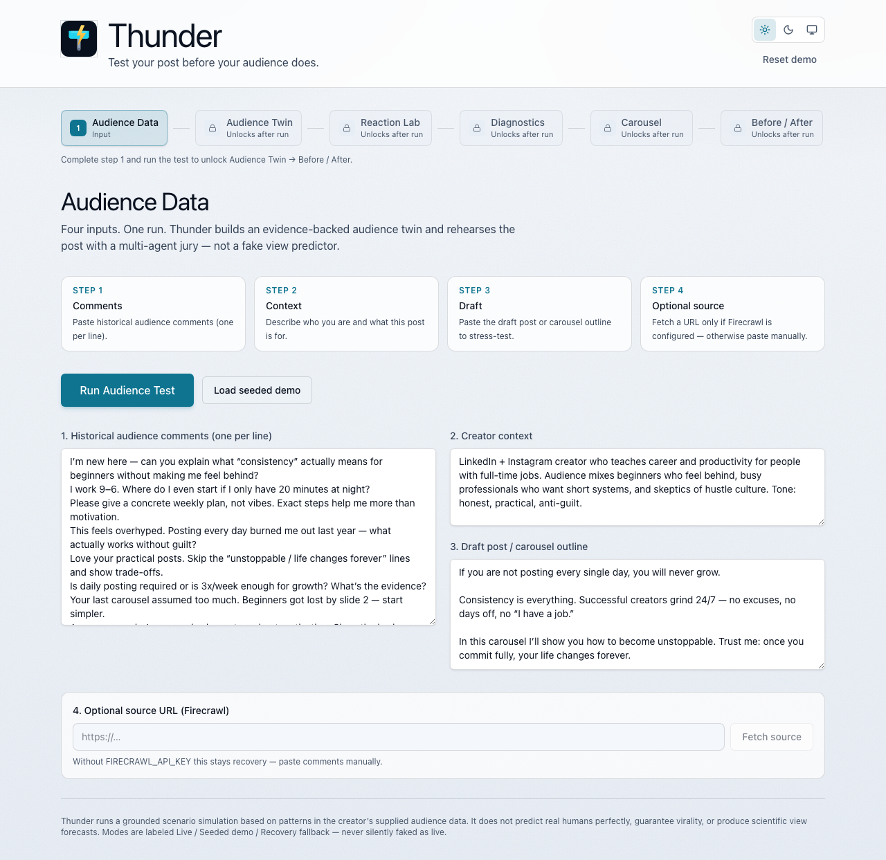
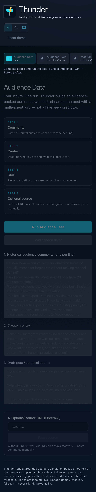
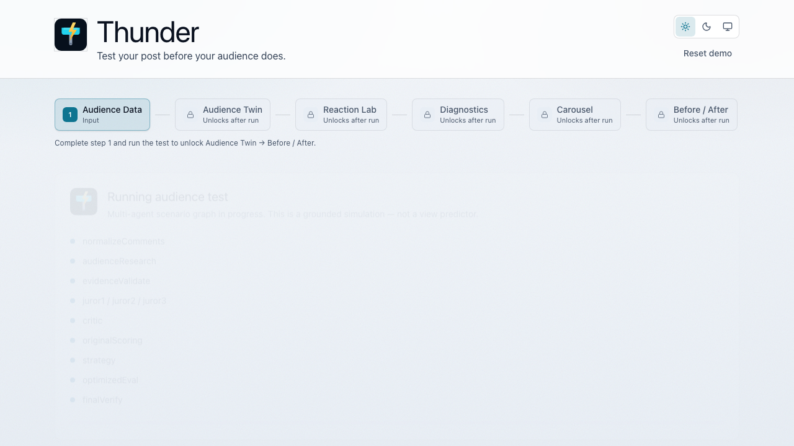
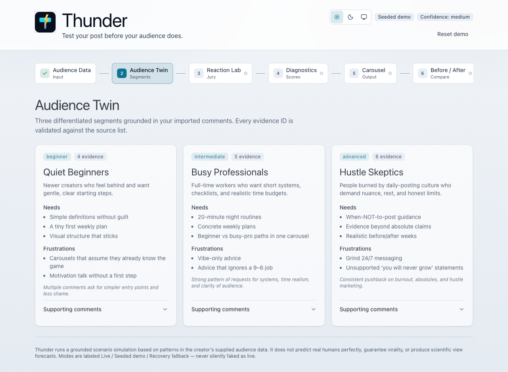
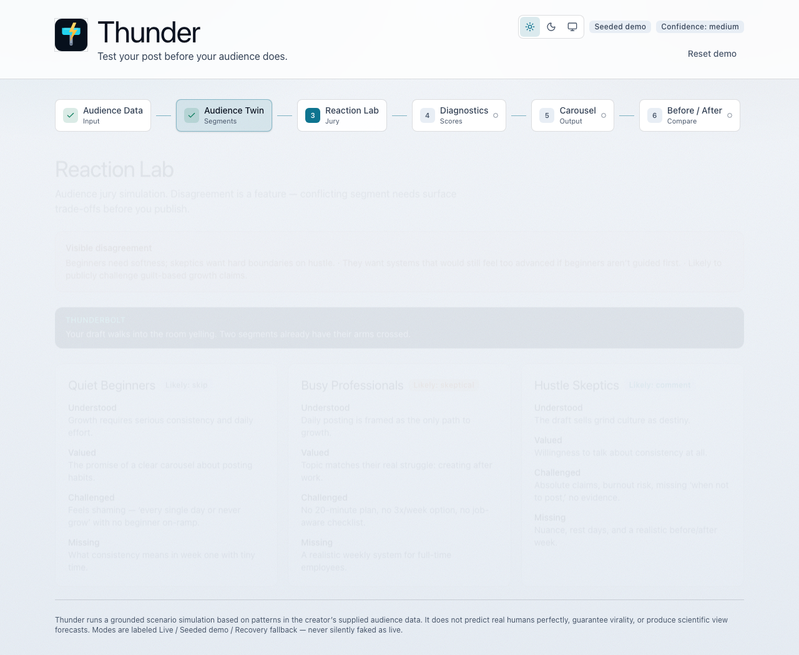
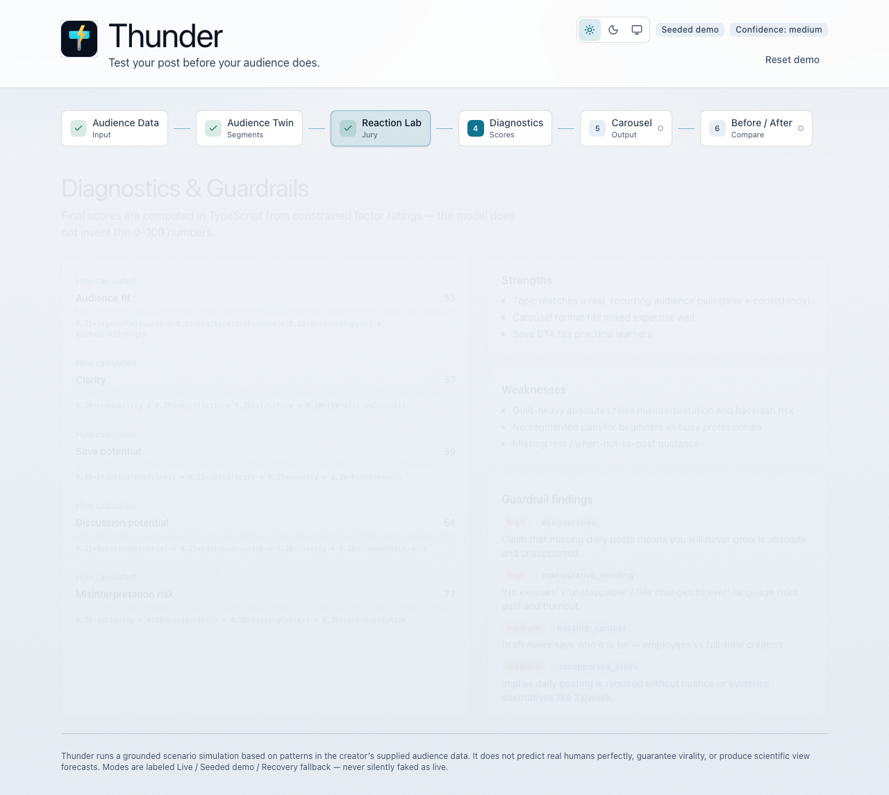
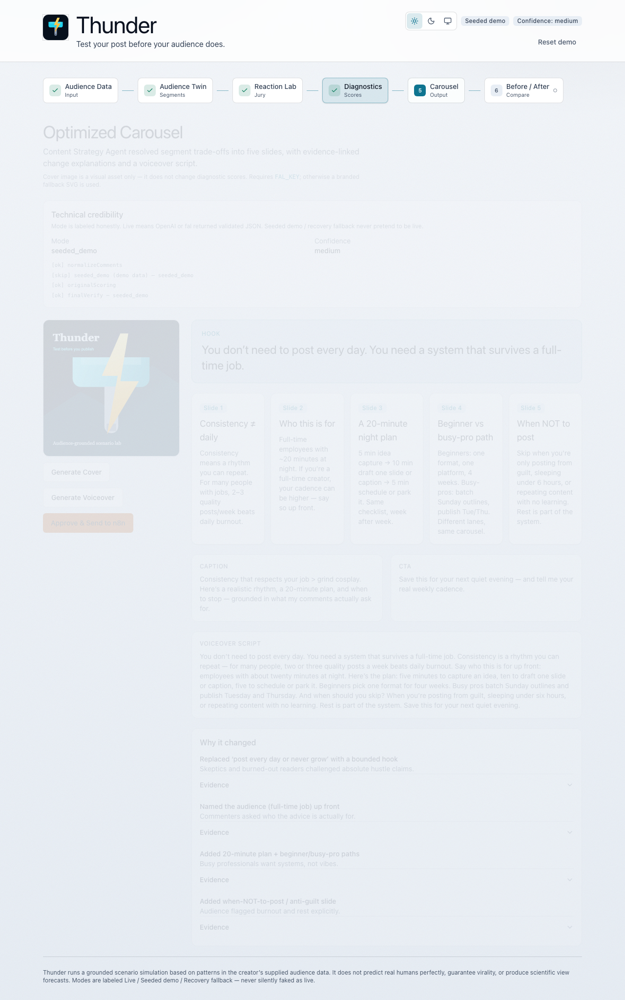
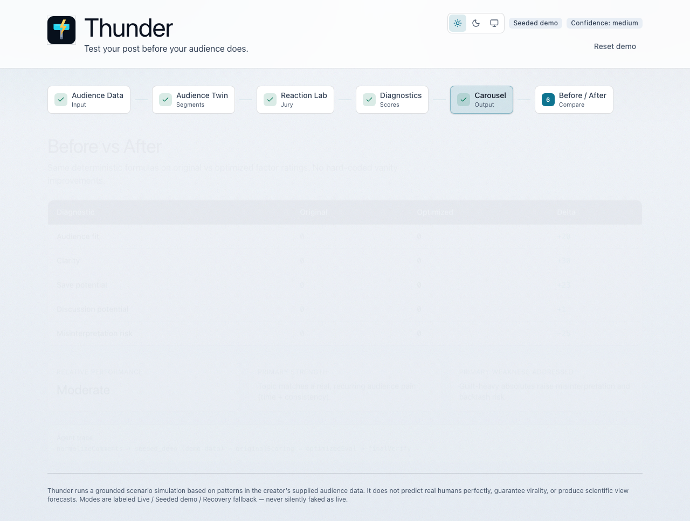
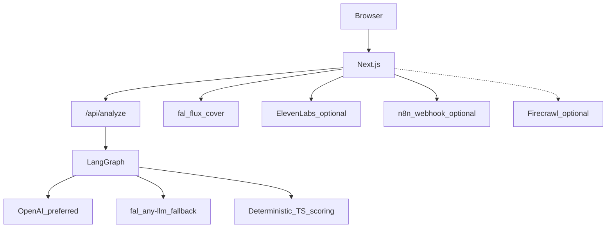

# Thunder

**Test your post before your audience does.**

Thunder is a pre-publication **scenario lab** for creators: turn historical comments into an evidence-backed audience twin, run a multi-agent jury rehearsal, score the draft with transparent TypeScript formulas, and ship an improved five-slide carousel — with modes labeled honestly as **Live**, **Seeded demo**, or **Recovery fallback**.

> Grounded simulation from *your* imported comments. Not a view predictor. Not a virality guarantee.

## Problem

Creators publish into silence or backlash because they only learn audience reaction *after* posting. Gut-check edits miss segment disagreements, weak evidence, and overclaim.

## Solution

1. Import historical comments + draft
2. Build a three-segment audience twin grounded in comment evidence IDs
3. Run three parallel juror personas + an adversarial critic
4. Score original vs optimized drafts with deterministic formulas
5. Export carousel (optional cover / voiceover / n8n handoff)

## Product surface (6 stages)

| Stage | What you see |
|-------|----------------|
| Audience Data | Comments → context → draft → optional source → **Run** |
| Audience Twin | Three evidence-linked segments |
| Reaction Lab | Disagreement across segments |
| Diagnostics | Deterministic scores + guardrails |
| Carousel | Optimized slides + optional cover/voice/n8n |
| Before / After | Score deltas + credibility panel |

## Jury & evidence

- Evidence IDs (`C01`…) come only from imported comments
- Invalid IDs are repaired or trigger a controlled retry — never invented as live truth
- Live language path prefers **OpenAI** when `OPENAI_API_KEY` is set; otherwise **fal.ai** `any-llm` when `FAL_KEY` is set
- Cover images use **fal.ai** Flux when `FAL_KEY` is set (visual only — does not affect scores)
- Without a live language key: labeled Seeded demo / Recovery fallback

## Agents (LangGraph)

```
normalize → audience → evidence → juror×3 (parallel) → critic
  → TS scoring → strategy (+ voiceoverScript) → optimized eval → verify
```

## Before / after

Diagnostics (clarity, specificity, audience fit, confidence) are computed in TypeScript from factor ratings. Strategy proposes bounded deltas; optimized scores are recomputed — not invented by the LLM.

## Sponsors / integrations actually used

| Integration | Role | Status |
|-------------|------|--------|
| OpenAI | Live audience / jurors / critic / strategy | Live when key present |
| fal.ai | Optional LM fallback + cover image | Cover needs `FAL_KEY` |
| Firecrawl | Optional source URL scrape | Optional |
| ElevenLabs | Optional voiceover audio | Optional |
| n8n | Approve & send webhook | Optional |
| Cursor | Build environment | Used |

## Screenshots

Playwright captures light/dark × desktop/mobile samples under [`docs/samples/screenshots/`](docs/samples/screenshots/).

| Flow | Light desktop | Dark mobile |
|------|---------------|-------------|
| Input |  |  |
| Running |  | — |
| Twin |  | — |
| Jury |  | — |
| Diagnostics |  | — |
| Carousel |  | — |
| Before/After |  | — |

## Architecture



Details: [docs/architecture.md](docs/architecture.md) · setup: [docs/developer-setup.md](docs/developer-setup.md)

## Quick start (seeded demo)

```bash
cp .env.example .env.local
npm install
npm run dev
```

Open [http://localhost:3000](http://localhost:3000) → **Load seeded demo** → **Run Audience Test**. No paid keys required for the seeded path.

## Testing evidence

```bash
npm run lint
npm run typecheck
npm test
npm run build
npm run test:e2e   # Playwright — forced seeded/fallback, no credit burn
```

Default E2E sets `FORCE_SEEDED_DEMO=true` so fal / ElevenLabs / Firecrawl / n8n credits are not consumed.

## Honest limitations

- Jury agents simulate segments from **imported comments**, not live humans
- Scores are transparent formulas over factor ratings — not platform analytics
- Cover / voice / n8n stay recovery until their keys/webhooks exist
- Reel / video generation is **not** shipped (not smoke-tested against a fal video model)
- Without OpenAI or fal language keys, runs are Seeded demo / Recovery fallback — never fake Live

## Deploy

Render blueprint: [`render.yaml`](render.yaml) (health check `/api/health`). Connect [github.com/harshjoshi23/Thunder](https://github.com/harshjoshi23/Thunder).

## Docs

- [docs/developer-setup.md](docs/developer-setup.md) — env names, n8n import, scripts
- [docs/demo-script.md](docs/demo-script.md)
- [docs/judge-questions.md](docs/judge-questions.md)
- [docs/EXPLAINER.md](docs/EXPLAINER.md)

## License

**GPL-3.0** — see [`LICENSE`](LICENSE).

Built for Cursor Hackathon Stuttgart.
