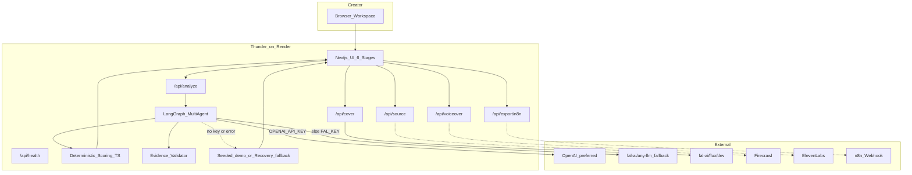
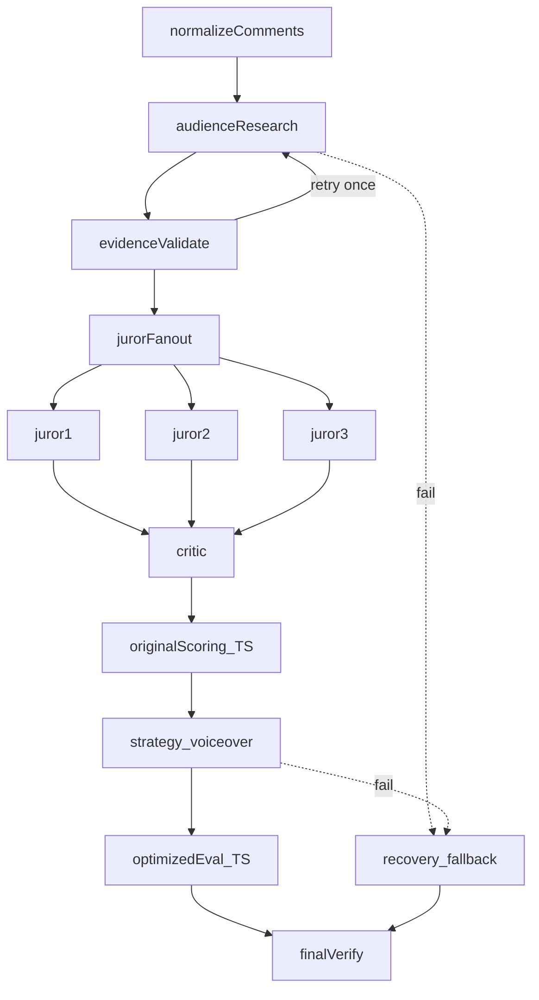
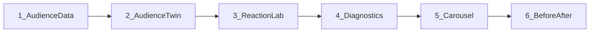
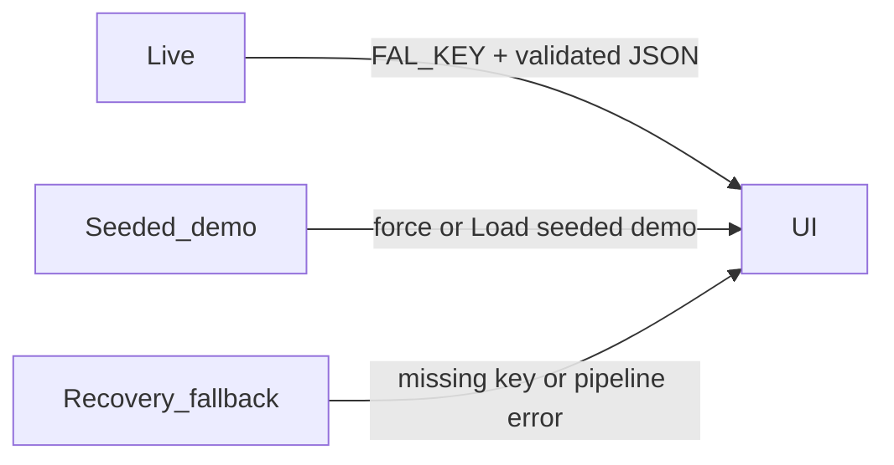

# Thunder architecture

Import into [diagrams.net](https://app.diagrams.net): **Arrange → Insert → Advanced → Mermaid**.

## System context

## Agent graph

## Language path

| Priority | Condition | Label |
|----------|-----------|-------|
| 1 | `OPENAI_API_KEY` | Live (OpenAI) |
| 2 | else `FAL_KEY` | Live (fal any-llm) |
| 3 | else / error + fallback | Seeded demo / Recovery fallback |

Cover images always use fal Flux when `FAL_KEY` is set.

## Model IDs

| Node | OpenAI default | fal fallback |
|------|----------------|--------------|
| Audience | `gpt-4o-mini` | `google/gemini-2.5-flash-lite` |
| Jurors | `gpt-4o-mini` | `google/gemini-2.5-flash` |
| Critic | `gpt-4o-mini` | `anthropic/claude-3-5-haiku` |
| Strategy | `gpt-4o-mini` | `google/gemini-2.5-flash` |
| Cover | — | `fal-ai/flux/dev` |

## UI stage map

## Honesty modes

## Future scale (not implemented)

Redis / Kafka fan-out for multi-tenant orchestration is **out of hackathon scope**. Documented in README only.
