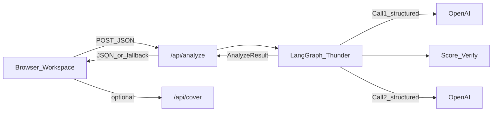
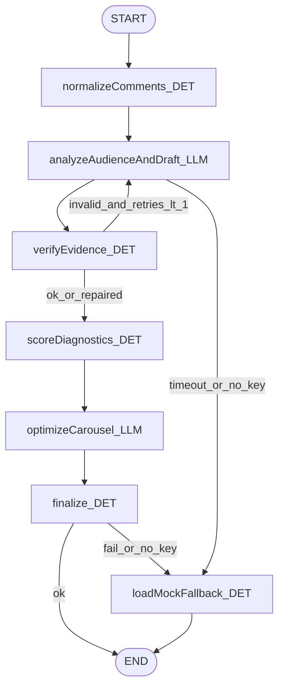
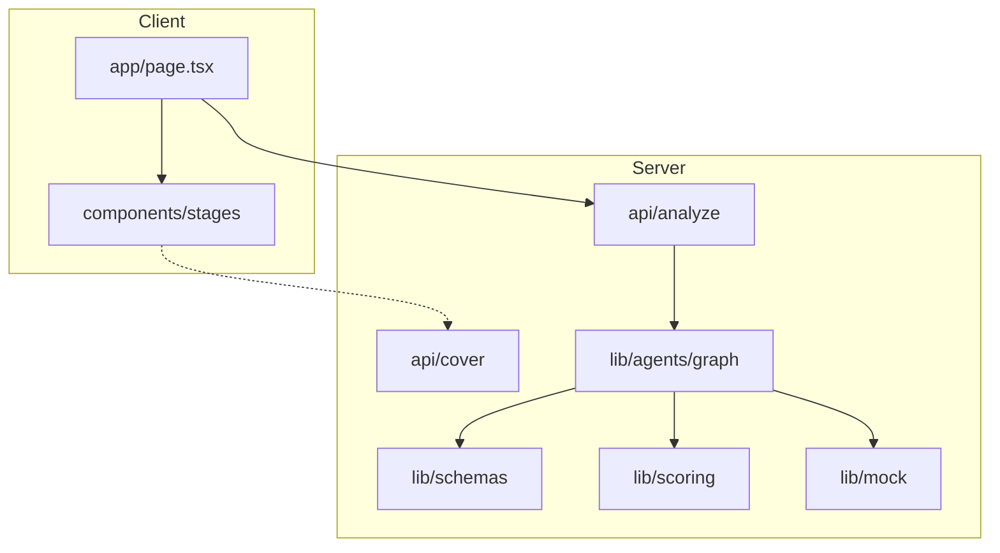

# Thunder Architecture

Import any Mermaid block into [diagrams.net](https://app.diagrams.net): **Arrange → Insert → Advanced → Mermaid**.

## Multi-agent decision

Thunder uses a **controlled multi-agent LangGraph**, not a single mega-prompt and not an uncontrolled swarm.

| Logical agent | Node | LLM? |
|---------------|------|------|
| Audience Research | part of Call 1 | Yes |
| Scenario Simulation | part of Call 1 | Yes |
| Adversarial Critic | part of Call 1 | Yes |
| Deterministic scoring | `scoreDiagnostics` | No |
| Evidence verification | `verifyEvidence` | No |
| Content Strategy | Call 2 `optimizeCarousel` | Yes |
| Finalize | `finalize` | No |

Exactly **2** OpenAI structured calls per live analysis (+ at most one Call 1 retry).

## Data flow

## Graph topology

## Component view

## Scoring (deterministic)

Factors are integers 0–10 from the LLM. Final diagnostics are computed in TypeScript:

- audienceFit = 0.35×segmentRelevance + 0.25×practicalUsefulness + 0.20×evidenceSupport + 0.20×hookStrength
- clarity = 0.30×readability + 0.25×specificity + 0.25×structure + 0.20×(10−missingContext)
- savePotential = 0.30×practicalUsefulness + 0.25×specificity + 0.25×novelty + 0.20×hookStrength
- discussionPotential = 0.35×questionPotential + 0.25×controversyRisk + 0.20×novelty + 0.20×segmentRelevance
- misinterpretationRisk = 0.30×ambiguity + 0.30×exaggeration + 0.20×missingContext + 0.20×controversyRisk

Optimized scores apply Call 2 factor deltas (±3) then re-run the same formulas.

## Evidence integrity

1. Comments normalized to `C01…Cn`
2. Model may only cite those IDs
3. `verifyEvidence` strips invalid IDs / retries once if fabrication is severe
4. UI never shows fabricated evidence silently
