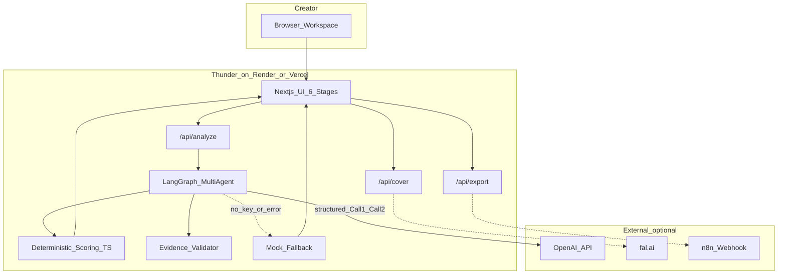
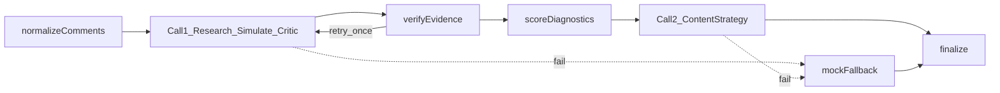
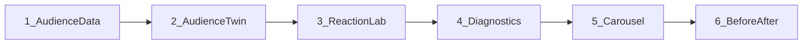
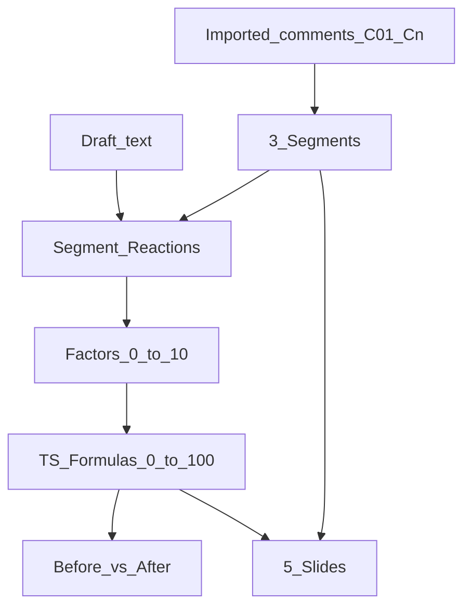

# Thunder architecture (presentation-grade)

Import into [diagrams.net](https://app.diagrams.net): **Arrange → Insert → Advanced → Mermaid**.

## System context

## Agent graph (what “real agents” means)

## UI stage map

## Data honesty

## Scaling note (pitch only — not built)

For a hackathon demo, one Node process on Render is enough.

**If** Thunder grew to many concurrent analyses later:

- Queue long LLM jobs (e.g. Redis/BullMQ) so HTTP requests don’t time out
- Keep scoring/evidence in-process (CPU-cheap)
- Kafka-style brokers are unnecessary until you have event fan-out across many services

Do not build this for the submission.
